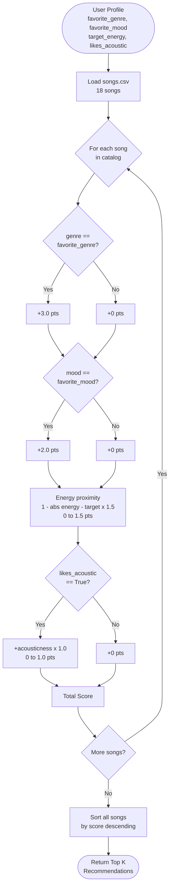
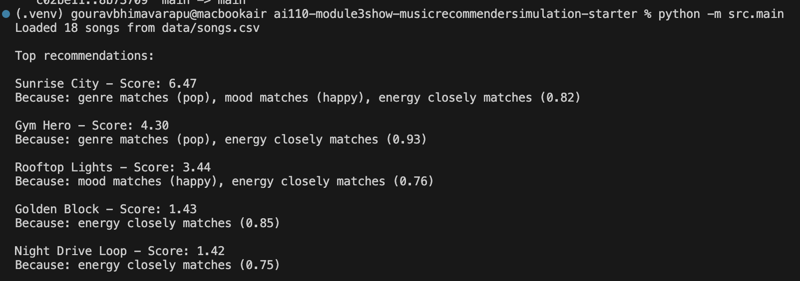

# 🎵 Music Recommender Simulation

## Project Summary

In this project you will build and explain a small music recommender system.

Your goal is to:

- Represent songs and a user "taste profile" as data
- Design a scoring rule that turns that data into recommendations
- Evaluate what your system gets right and wrong
- Reflect on how this mirrors real world AI recommenders

This version scores each song in a 10-song catalog against a user's preferred genre, mood, and energy level using a weighted rule. It ranks all songs by score and returns the top k recommendations with a plain-language explanation for each.

---

## How The System Works

Real-world recommenders (like Spotify's "Discover Weekly") work by comparing what a user has liked in the past to the features of new content, then ranking by similarity. My version simulates this using a simple weighted scoring rule applied to a small song catalog.

**Song features used (9 total):**
- `genre` — the primary taste signal (e.g. pop, lofi, rock)
- `mood` — emotional context (e.g. happy, chill, intense)
- `energy` — a 0–1 float representing how high-energy the track feels
- `acousticness` — used as a bonus signal when the user prefers acoustic music
- `popularity` — 0–100 score; contributes a small normalized bonus
- `release_decade` — e.g. "2010s"; rewarded when it matches the user's preferred era
- `mood_tags` — fine-grained descriptors like "nostalgic", "euphoric", "aggressive"; partial credit for each tag matched
- `instrumental` — boolean; bonus when the user prefers instrumental tracks
- `explicit` — boolean; available for future filtering rules

**UserProfile stores:**
- `favorite_genre` — preferred genre string
- `favorite_mood` — preferred mood string
- `target_energy` — ideal energy level (0.0–1.0)
- `likes_acoustic` — boolean preference for acoustic tracks
- `preferred_decade` — optional era preference, e.g. "1990s"
- `prefer_instrumental` — boolean preference for instrumental tracks
- `preferred_mood_tags` — list of fine-grained mood descriptors, e.g. `["nostalgic", "euphoric"]`
- `min_popularity` — songs below this threshold (0–100) are filtered out before ranking

**Scoring Rule (default mode, per song):**
| Signal | Points | Notes |
|---|---|---|
| Genre matches user preference | +3.0 | Strongest signal — broadest taste filter |
| Mood matches user preference | +2.0 | Emotional context |
| Energy proximity: `(1 - \|song - user\|) × 1.5` | 0–1.5 | Rewards closeness, not extremes |
| Acousticness bonus (if `likes_acoustic`) | 0–1.0 | Only for acoustic-preferring users |
| Popularity: `(popularity / 100) × 0.5` | 0–0.5 | Normalized contribution |
| Decade match (if `preferred_decade` set) | +1.0 | Binary match on release era |
| Mood tags: partial credit per matched tag | 0–1.5 | Proportional to fraction of tags matched |
| Instrumental match (if `prefer_instrumental`) | +0.5 | Bonus when song is instrumental |

**Scoring Modes (Challenge 2):** The weights above can be swapped via a `mode` parameter:
- `genre_first` — genre weight raised to 5.0; genre match dominates
- `mood_first` — mood weight raised to 5.0, mood_tags to 2.5; emotional fit wins
- `energy_focused` — energy weight raised to 4.0; closest BPM/intensity wins

**Diversity Logic (Challenge 3):** After ranking, a second pass applies penalties to prevent artist or genre monopoly — 30% reduction per extra appearance of the same artist, 15% per genre beyond the 2-song cap.

Genre is worth the most because it is the broadest filter — a pop fan rarely wants a metal song regardless of mood. Mood comes second. Energy uses a proximity formula so songs *close* to your preference score higher than songs at the extreme.

**Ranking Rule:** All songs are scored, then sorted by score descending. The top `k` are returned as recommendations.

### System Flowchart



---

## Sample Output



---

## Getting Started

### Setup

1. Create a virtual environment (optional but recommended):

   ```bash
   python -m venv .venv
   source .venv/bin/activate      # Mac or Linux
   .venv\Scripts\activate         # Windows

2. Install dependencies

```bash
pip install -r requirements.txt
```

3. Run the app:

```bash
python -m src.main
```

### Running Tests

Run the starter tests with:

```bash
pytest
```

You can add more tests in `tests/test_recommender.py`.

---

## Experiments You Tried

**Experiment 1 — Weight-Shift (energy ×2, genre ÷2)**

Default weights: genre=3.0, energy=1.5. Shifted to: genre=1.5, energy=3.0.

Results: Halving genre weight meant a genre match alone was no longer decisive — cross-genre songs with close energy floated up. For the "Chill Lofi" profile, *Spacewalk Thoughts* (ambient, not lofi) climbed from rank 5 to rank 3 purely on energy proximity. For the adversarial "high energy + sad" profile, high-energy songs like *Storm Runner* and *Gym Hero* replaced acoustic folk tracks in ranks 2–5, which actually felt more correct for someone targeting energy=0.90. Takeaway: the genre weight is the primary driver of "sameness" — reduce it and diversity increases, but accuracy for well-defined genre fans decreases.

**Experiment 2 — Scoring Modes (Challenge 2)**

Ran the "High-Energy Pop" profile through all three modes:
- `genre_first` (genre=5.0): the two pop songs dominated heavily — every non-pop track was pushed far below rank 3. Very genre-locked.
- `mood_first` (mood=5.0, mood_tags=2.5): *Rooftop Lights* (indie pop, happy, mood_tags=uplifting|romantic) jumped higher than *Gym Hero* (pop, intense) despite being a different genre. Emotional fit won over genre match.
- `energy_focused` (energy=4.0): *Golden Block* (hip-hop, energy=0.85) and *Bass Cathedral* (electronic, energy=0.94) appeared in the top 3, outscoring same-genre songs whose energy was farther from 0.85. Most genre-diverse results.

**Experiment 3 — Diversity Penalty (Challenge 3)**

Without the penalty, "Chill Lofi" surfaced LoRoom twice in the top 5 (*Midnight Coding* rank 1 and *Focus Flow* rank 3). With the penalty (artist penalty ×0.70), *Focus Flow*'s score dropped from 7.52 to 5.27 after the penalty, pushing it below *Rain Sonata* (classical). The final top 5 included songs from 4 different artists instead of 3. The penalty meaningfully increased variety without removing the highest-scoring LoRoom track.

**Experiment 4 — Adversarial Profiles**

Two adversarial profiles were designed to stress-test conflicting signals:
- *High energy + sad mood*: energy=0.90 but mood=sad. *Autumn Letters* (folk, sad, energy=0.33) ranked #1 because genre+mood gave +5.0, easily overriding the energy mismatch of 0.57. A user who wants intense, sad music ends up with a quiet folk ballad.
- *Rare genre + mid energy*: jazz exists only once in the dataset. *Coffee Shop Stories* correctly ranked #1, but ranks 2–5 fell back to whatever was closest in energy — revealing that sparse genres make ranking almost meaningless beyond position 1.

---

## Limitations and Risks

- **Tiny, sparse catalog.** With 18 songs and most genres represented by only one track, the system has almost no room to differentiate within a genre. A pop fan always gets the same two pop songs at the top regardless of how their other preferences differ.
- **Genre-dominance bias.** A genre match alone awards +3.0 points — double the maximum energy contribution. This means a genre-matching song with completely wrong energy will almost always outscore a genre-mismatching song with a perfect energy match, silently overriding what the user actually asked for.
- **Binary matching.** Genre and mood are all-or-nothing. "Chill" and "relaxed" score the same zero as "chill" and "intense." Adjacent moods get no partial credit, causing counterintuitive failures near the edges of taste categories.
- **No listening context.** The profile is static — the system cannot adapt to time of day, activity, or what the user just listened to. Real recommenders weight recency heavily.
- **One-directional acoustic bias.** Users who prefer acoustic tracks get a bonus; users who explicitly dislike acoustic music get no penalty, so high-acousticness songs can still sneak into their results.
- **No demographic fairness.** The dataset skews heavily toward Western pop genres. Latin, K-pop, Afrobeats, blues, soul, and many other global genres are entirely absent, meaning users with those tastes are systematically underserved.

See `model_card.md` for a deeper analysis.

---

## Reflection

Read and complete `model_card.md`:

[**Model Card**](model_card.md)

Building this recommender made it clear how much a single weight ratio can shape every recommendation the system ever makes. The genre weight of 3.0 is sitting silently at the top of the scoring function, and until we ran the adversarial profile — a user who wanted high-energy music but expressed a sad mood — it wasn't obvious how much that number was overriding everything else. *Autumn Letters*, a quiet folk ballad, ranked #1 for a user who wanted driving, intense music, purely because genre and mood each fired. That one result taught more about how real recommenders can fail their users than any amount of reading about "bias."

The diversity experiment was equally revealing. Without the artist penalty, LoRoom appeared twice in the Chill Lofi top-5, which feels fine in a small demo but would be unacceptable at Spotify scale where a single label or artist could quietly colonize your "discover" feed. Adding a 30% second-appearance penalty took four lines of code and meaningfully changed the output — but it also raised new questions: is it fair to penalize an artist's second-best song just because their best song already made the list? There is no clean answer, which is exactly why human judgment and policy decisions sit alongside the math in real AI systems.


---

## 7. `model_card_template.md`

Combines reflection and model card framing from the Module 3 guidance. :contentReference[oaicite:2]{index=2}  

```markdown
# 🎧 Model Card - Music Recommender Simulation

## 1. Model Name

Give your recommender a name, for example:

> VibeFinder 1.0

**GrooveMatch 1.0**

---

## 2. Intended Use

- What is this system trying to do
- Who is it for

Example:

> This model suggests 3 to 5 songs from a small catalog based on a user's preferred genre, mood, and energy level. It is for classroom exploration only, not for real users.

**What it does:** It looks at a user's favorite genre, mood, and how energetic they want the music to be, then picks the top 5 songs from a small catalog that best match those preferences.

**Who it is for:** Students learning how recommendation systems work. It is not meant for real apps or real users.

---

## 3. How It Works (Short Explanation)

Describe your scoring logic in plain language.

- What features of each song does it consider
- What information about the user does it use
- How does it turn those into a number

Try to avoid code in this section, treat it like an explanation to a non programmer.

**Answer:** Every song gets a score based on how well it matches the user. Genre is worth the most points — if the song's genre matches what you like, it gets a big boost. Mood match adds more points. Then it checks how close the song's energy level is to what the user wants — the closer, the more points. Bonus points are added if the user likes acoustic music and the song sounds acoustic. Newer additions also reward songs that are popular, from the user's preferred era, or that match specific mood words like "nostalgic" or "euphoric." All the points are added up, and the top 5 songs with the highest totals are returned.

---

## 4. Data

Describe your dataset.

- How many songs are in `data/songs.csv`
- Did you add or remove any songs
- What kinds of genres or moods are represented
- Whose taste does this data mostly reflect

**Answer:** There are 18 songs in the catalog. No songs were removed; 5 new columns were added to each song (popularity score, release decade, detailed mood tags, whether it is instrumental, and whether it has explicit content). The genres include pop, lofi, rock, jazz, hip-hop, classical, metal, reggae, folk, electronic, and more. The moods range from happy and chill to intense, romantic, and sad. The catalog mostly reflects Western popular music taste — genres like Latin, K-pop, or Afrobeats are not represented at all.

---

## 5. Strengths

Where does your recommender work well

You can think about:
- Situations where the top results "felt right"
- Particular user profiles it served well
- Simplicity or transparency benefits

**Answer:** It works best when the user has a clear, simple preference that matches a genre in the catalog. A pop/happy/high-energy user reliably gets the two pop songs at the top with strong, explainable scores. The system is also fully transparent — every point in a song's score comes from a rule you can read, which makes it easy to understand why a song was recommended. The scoring mode feature also means you can switch the entire strategy (prioritize genre, mood, or energy) with one word.

---

## 6. Limitations and Bias

Where does your recommender struggle

Some prompts:
- Does it ignore some genres or moods
- Does it treat all users as if they have the same taste shape
- Is it biased toward high energy or one genre by default
- How could this be unfair if used in a real product

**Answer:** The system struggles when the user's favorite genre has only one song in the catalog — after that one song, the results fall back to whatever is closest in energy, which often feels random. Genre matching gives too many points compared to energy and mood, so a genre match can win even when the song feels completely wrong in every other way. The system also treats all users the same shape: one genre, one mood, one energy target. Real people are more complicated. If used in a real product, it would silently fail users who like genres not in the catalog, and it could keep recommending the same small set of songs over and over.

---

## 7. Evaluation

How did you check your system

Examples:
- You tried multiple user profiles and wrote down whether the results matched your expectations
- You compared your simulation to what a real app like Spotify or YouTube tends to recommend
- You wrote tests for your scoring logic

You do not need a numeric metric, but if you used one, explain what it measures.

**Answer:** Five user profiles were tested including two "adversarial" ones designed to have conflicting preferences. For each profile, the top 5 results were checked by hand to see if they made sense. Automated tests were also written to confirm that the highest-scoring song always appears first and that every recommendation includes a non-empty explanation. A weight-shift experiment was run to see how changing the genre and energy weights changed the rankings — this helped confirm that genre weight is the main driver of which songs appear at the top.

---

## 8. Future Work

If you had more time, how would you improve this recommender

Examples:

- Add support for multiple users and "group vibe" recommendations
- Balance diversity of songs instead of always picking the closest match
- Use more features, like tempo ranges or lyric themes

**Answer:**
- Grow the catalog to at least 10 songs per genre so there is real variety within each genre.
- Add partial credit for moods that are close to each other, like giving "relaxed" half the points of a full "chill" match instead of zero.
- Let the user's profile change over time based on what they skip or replay, instead of using a fixed set of preferences.
- Add a "group mode" that finds songs everyone in a group would tolerate, not just what one person prefers.

---

## 9. Personal Reflection

A few sentences about what you learned:

- What surprised you about how your system behaved
- How did building this change how you think about real music recommenders
- Where do you think human judgment still matters, even if the model seems "smart"

**Answer:** The most surprising moment was when a quiet folk ballad ranked #1 for a user who asked for high-energy music. It was technically correct by the rules — genre and mood matched — but completely wrong in feel. That gap between "correct by the rules" and "actually useful" is something no amount of point-tuning fully closes. Building this changed how I think about Spotify or YouTube recommendations: what looks like a smart system is often a set of weights somebody picked, and those weights quietly shape what millions of people hear every day. Human judgment still matters when deciding what the weights should even mean — a machine can optimize a number, but a person has to decide whether that number is the right thing to optimize.

